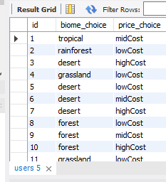

# Off the Beaten Path
## Project Two of U of A Bootcamp

## Description 

This is a full stack web application that allows users to select their travel preferences and matches them with an "Off the Beaten Path" travel destination.

Each user is assigned a unique id that is stored along with their answer selections in a mySQL database.

The user's answers are then compared to the another table in the database containing the destinations to find the location that matches the user's preferences.

The name of the destination as well as the image paths are pulled from the database and displayed in the user's results page.

### Technologies Utilized

* HTML
* CSS
* JavaScript
* jQuery
* Bootstrap
* MySQL
* Node.js
* Express.js
* Heroku